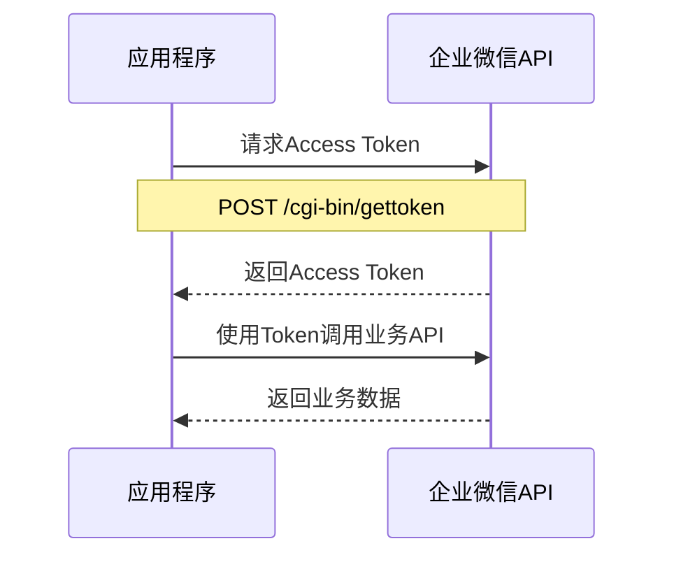

# API规格说明 - 企业微信集成接口

## 1. 企业微信API概览

### 1.1 基础信息
- **API版本**: 企业微信API v2.0
- **基础URL**: `https://qyapi.weixin.qq.com`
- **认证方式**: Access Token
- **数据格式**: JSON
- **字符编码**: UTF-8

### 1.2 认证流程


## 2. 核心API接口

### 2.1 获取Access Token

**接口地址**: `GET /cgi-bin/gettoken`

**请求参数**:
```json
{
  "corpid": "企业ID",
  "corpsecret": "应用密钥"
}
```

**响应示例**:
```json
{
  "errcode": 0,
  "errmsg": "ok",
  "access_token": "ACCESS_TOKEN_VALUE",
  "expires_in": 7200
}
```

**Python实现**:
```python
def get_access_token(corp_id: str, corp_secret: str) -> str:
    url = f"{BASE_URL}/cgi-bin/gettoken"
    params = {
        "corpid": corp_id,
        "corpsecret": corp_secret
    }
    response = requests.get(url, params=params)
    data = response.json()
    
    if data["errcode"] != 0:
        raise APIError(f"获取Token失败: {data['errmsg']}")
    
    return data["access_token"]
```

### 2.2 获取员工假期余额

**接口说明**: 获取指定员工的年假余额信息

**请求方式**: POST

**请求URL**: `/cgi-bin/oa/vacation/getuservacationquota`

**官方文档**: https://developer.work.weixin.qq.com/document/path/93376

**请求参数**:
```json
{
  "userid": "employee_userid"
}
```

**响应示例**:
 ```json
 {
   "errcode": 0,
   "errmsg": "ok",
   "lists": [
     {
       "id": 1,
       "assignduration": 230400,
       "usedduration": 129600,
       "leftduration": 100800,
       "vacationname": "年假",
       "real_assignduration": 230400
     },
     {
       "id": 2,
       "assignduration": 1296000,
       "usedduration": 0,
       "leftduration": 1296000,
       "vacationname": "事假",
       "real_assignduration": 1296000
     }
   ]
 }
 ```

 **响应字段说明**:
 - `id`: 假期类型ID
 - `assignduration`: 分配的假期时长（秒）
 - `usedduration`: 已使用的假期时长（秒）
 - `leftduration`: 剩余的假期时长（秒）
 - `vacationname`: 假期类型名称
 - `real_assignduration`: 实际分配的假期时长（秒）

 **时长转换**:
 - 企业微信API返回的时长单位为秒
 - 转换为小时: `小时 = 秒 / 3600`
 - 转换为天数: `天数 = 小时 / 24`（按24小时工作制）

### 2.3 获取部门用户列表

**接口地址**: `GET /cgi-bin/user/list`

**请求参数**:
```json
{
  "access_token": "ACCESS_TOKEN",
  "department_id": 1,
  "fetch_child": 1
}
```

**响应示例**:
```json
{
  "errcode": 0,
  "errmsg": "ok",
  "userlist": [
    {
      "userid": "zhangsan",
      "name": "张三",
      "department": [1, 2],
      "position": "产品经理",
      "mobile": "13800000000",
      "email": "zhangsan@company.com",
      "status": 1
    }
  ]
}
```

### 2.4 根据姓名查找用户

**自定义方法** (基于用户列表接口):
```python
def find_user_by_name(access_token: str, name: str) -> str:
    """根据姓名查找用户ID"""
    url = f"{BASE_URL}/cgi-bin/user/list"
    params = {
        "access_token": access_token,
        "department_id": 1,
        "fetch_child": 1
    }
    
    response = requests.get(url, params=params)
    data = response.json()
    
    if data["errcode"] != 0:
        raise APIError(f"获取用户列表失败: {data['errmsg']}")
    
    for user in data["userlist"]:
        if user["name"] == name:
            return user["userid"]
    
    raise EmployeeNotFoundError(f"未找到员工: {name}")
```

### 2.5 获取审批数据

**接口地址**: `POST /cgi-bin/oa/getapprovaldata`

**请求参数**:
```json
{
  "access_token": "ACCESS_TOKEN",
  "starttime": 1569859200,
  "endtime": 1572537599,
  "cursor": 0,
  "size": 100,
  "filters": [
    {
      "key": "template_id",
      "value": "假期申请模板ID"
    },
    {
      "key": "applyer",
      "value": "zhangsan"
    }
  ]
}
```

**响应示例**:
```json
{
  "errcode": 0,
  "errmsg": "ok",
  "data": [
    {
      "spno": "202511150001",
      "spname": "年假申请",
      "spstatus": 2,
      "template_id": "TEMPLATE_ID",
      "apply_time": 1573020000,
      "applyer": {
        "userid": "zhangsan",
        "partyid": "1"
      },
      "sprecord": [
        {
          "spstatus": 1,
          "approverattr": 1,
          "details": [
            {
              "approver": {
                "userid": "lisi"
              },
              "speech": "同意",
              "sptime": 1573020000
            }
          ]
        }
      ],
      "apply_data": {
        "contents": [
          {
            "control": "Date",
            "id": "Date-001",
            "title": [
              {
                "text": "开始时间",
                "lang": "zh_CN"
              }
            ],
            "value": {
              "date": "2025-06-01"
            }
          },
          {
            "control": "Number",
            "id": "Number-001", 
            "title": [
              {
                "text": "请假天数",
                "lang": "zh_CN"
              }
            ],
            "value": {
              "number": "5"
            }
          }
        ]
      }
    }
  ]
}
```

## 3. 假期余额API设计

### 3.1 假期余额查询接口

由于企业微信标准API可能不直接提供假期余额查询，需要通过以下方式实现：

**方案1: 通过审批记录计算**
```python
def get_leave_balance_from_approvals(access_token: str, user_id: str, year: int) -> LeaveBalance:
    """通过审批记录计算假期余额"""
    # 1. 获取年度所有年假审批记录
    approvals = get_annual_leave_approvals(access_token, user_id, year)
    
    # 2. 计算已用时长
    used_hours = sum(approval.hours for approval in approvals if approval.status == "approved")
    
    # 3. 从HR系统或配置获取理论时长
    theoretical_hours = get_theoretical_annual_leave(user_id, year)
    
    # 4. 计算剩余时长
    remaining_hours = theoretical_hours - used_hours
    
    return LeaveBalance(
        used_hours=used_hours,
        remaining_hours=remaining_hours,
        theoretical_hours=theoretical_hours,
        year=year
    )
```

**方案2: 自定义应用API**
```python
# 如果企业有自定义的假期管理应用
def get_leave_balance_from_custom_app(access_token: str, user_id: str) -> LeaveBalance:
    """从自定义假期应用获取余额"""
    url = f"{BASE_URL}/cgi-bin/miniprogram/jscode2session"  # 示例接口
    data = {
        "access_token": access_token,
        "userid": user_id,
        "year": 2025
    }
    
    response = requests.post(url, json=data)
    result = response.json()
    
    if result["errcode"] != 0:
        raise APIError(f"获取假期余额失败: {result['errmsg']}")
    
    return LeaveBalance(
        used_hours=result["used_hours"],
        remaining_hours=result["remaining_hours"], 
        theoretical_hours=result["theoretical_hours"],
        year=result["year"]
    )
```

## 4. 错误处理规范

### 4.1 标准错误码

| 错误码 | 说明 | 处理方式 |
|--------|------|----------|
| 0 | 成功 | 正常处理 |
| 40001 | 不合法的secret参数 | 检查配置文件 |
| 40014 | 不合法的access_token | 重新获取token |
| 42001 | access_token超时 | 刷新token |
| 60011 | 不存在该用户 | 提示用户不存在 |
| 60020 | 部门不存在 | 检查部门配置 |

### 4.2 错误处理实现

```python
class WeChatAPIError(Exception):
    def __init__(self, errcode: int, errmsg: str):
        self.errcode = errcode
        self.errmsg = errmsg
        super().__init__(f"企业微信API错误 [{errcode}]: {errmsg}")

def handle_api_response(response_data: dict):
    """统一处理API响应"""
    errcode = response_data.get("errcode", -1)
    errmsg = response_data.get("errmsg", "未知错误")
    
    if errcode == 0:
        return response_data
    
    # Token相关错误，尝试刷新
    if errcode in [40014, 42001]:
        raise TokenExpiredError(errcode, errmsg)
    
    # 用户不存在
    if errcode == 60011:
        raise EmployeeNotFoundError(errcode, errmsg)
    
    # 其他错误
    raise WeChatAPIError(errcode, errmsg)
```

## 5. 配置管理

### 5.1 环境配置

```env
# 企业微信配置
WECHAT_CORP_ID=ww1234567890abcdef
WECHAT_CORP_SECRET=your_secret_key_here
WECHAT_AGENT_ID=1000001
WECHAT_BASE_URL=https://qyapi.weixin.qq.com

# API配置
API_TIMEOUT=30
API_RETRY_COUNT=3
API_RETRY_DELAY=1

# 假期配置
ANNUAL_LEAVE_TEMPLATE_ID=template_id_for_annual_leave
DEFAULT_ANNUAL_LEAVE_HOURS=120

# 日志配置
LOG_LEVEL=INFO
LOG_FILE=logs/api.log
```

### 5.2 配置验证

```python
def validate_wechat_config(config: WeChatConfig) -> bool:
    """验证企业微信配置"""
    required_fields = ["corp_id", "corp_secret", "agent_id"]
    
    for field in required_fields:
        if not getattr(config, field):
            raise ConfigError(f"缺少必要配置: {field}")
    
    # 测试API连接
    try:
        token = get_access_token(config.corp_id, config.corp_secret)
        return True
    except Exception as e:
        raise ConfigError(f"API连接测试失败: {str(e)}")
```

## 6. 性能优化

### 6.1 缓存策略

```python
class TokenCache:
    def __init__(self):
        self._token = None
        self._expires_at = None
    
    def get_token(self, corp_id: str, corp_secret: str) -> str:
        """获取缓存的token或重新获取"""
        now = time.time()
        
        if self._token and self._expires_at and now < self._expires_at:
            return self._token
        
        # 重新获取token
        response = get_access_token(corp_id, corp_secret)
        self._token = response["access_token"]
        self._expires_at = now + response["expires_in"] - 300  # 提前5分钟过期
        
        return self._token
```

### 6.2 请求优化

```python
class WeChatAPIClient:
    def __init__(self, config: WeChatConfig):
        self.config = config
        self.session = requests.Session()
        self.session.timeout = config.timeout
        
        # 连接池配置
        adapter = HTTPAdapter(
            pool_connections=10,
            pool_maxsize=20,
            max_retries=Retry(
                total=config.retry_count,
                backoff_factor=config.retry_delay
            )
        )
        self.session.mount("https://", adapter)
```

## 7. 测试规范

### 7.1 API测试用例

```python
class TestWeChatAPI:
    def test_get_access_token_success(self):
        """测试成功获取access token"""
        pass
    
    def test_get_access_token_invalid_secret(self):
        """测试无效密钥"""
        pass
    
    def test_find_user_by_name_exists(self):
        """测试查找存在的用户"""
        pass
    
    def test_find_user_by_name_not_exists(self):
        """测试查找不存在的用户"""
        pass
    
    def test_get_leave_balance_success(self):
        """测试成功获取假期余额"""
        pass
```

### 7.2 Mock测试

```python
@patch('requests.get')
def test_api_with_mock(mock_get):
    """使用Mock进行API测试"""
    mock_response = Mock()
    mock_response.json.return_value = {
        "errcode": 0,
        "errmsg": "ok",
        "access_token": "mock_token",
        "expires_in": 7200
    }
    mock_get.return_value = mock_response
    
    token = get_access_token("test_corp", "test_secret")
    assert token == "mock_token"
```