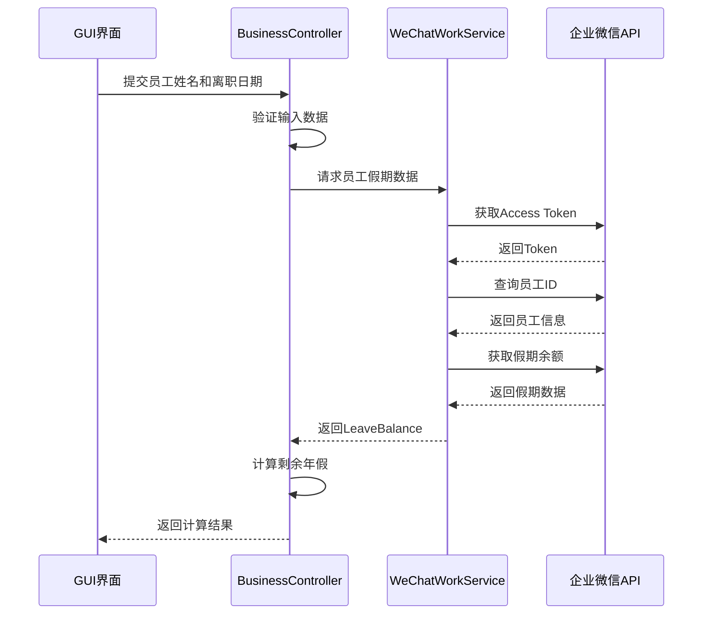

# 系统架构设计 - 离职员工剩余年假计算程序

## 1. 系统架构概览

### 1.1 架构模式
采用**分层架构模式（Layered Architecture）**，确保关注点分离和代码可维护性：

```
┌─────────────────────────────────────┐
│           表示层 (GUI Layer)          │
│         tkinter / PyQt5            │
├─────────────────────────────────────┤
│          业务逻辑层 (Business)        │
│      年假计算 + 数据验证 + 流程控制     │
├─────────────────────────────────────┤
│         服务层 (Service Layer)       │
│       企业微信API服务 + 配置服务       │
├─────────────────────────────────────┤
│         数据访问层 (Data Layer)       │
│      HTTP客户端 + 配置文件读取        │
└─────────────────────────────────────┘
```

### 1.2 核心组件

#### 1.2.1 GUI组件 (Presentation Layer)
- **MainWindow**: 主窗口控制器
- **InputPanel**: 输入面板（员工姓名、离职日期）
- **ResultPanel**: 结果显示面板
- **ButtonPanel**: 操作按钮面板

#### 1.2.2 业务逻辑组件 (Business Layer)
- **LeaveCalculator**: 年假计算核心算法
- **InputValidator**: 输入数据验证器
- **BusinessController**: 业务流程控制器

#### 1.2.3 服务组件 (Service Layer)
- **WeChatWorkService**: 企业微信API服务
- **ConfigService**: 配置管理服务
- **DateService**: 日期处理服务

#### 1.2.4 数据访问组件 (Data Layer)
- **HttpClient**: HTTP请求客户端
- **ConfigReader**: 配置文件读取器

## 2. 详细组件设计

### 2.1 GUI层设计

```python
# 主窗口架构
class MainWindow:
    - input_panel: InputPanel
    - result_panel: ResultPanel  
    - button_panel: ButtonPanel
    - controller: BusinessController
    
    + initialize_ui()
    + bind_events()
    + show_error(message)
    + show_result(result)

class InputPanel:
    - name_entry: Entry
    - date_entry: DateEntry
    
    + get_employee_name() -> str
    + get_resignation_date() -> date
    + clear_inputs()
    + validate_inputs() -> bool

class ResultPanel:
    - result_label: Label
    - details_text: Text
    
    + display_result(days: float)
    + display_calculation_details(details: dict)
    + clear_result()
```

### 2.2 业务逻辑层设计

```python
class LeaveCalculator:
    + calculate_remaining_leave(
        theoretical_hours: float,
        used_hours: float, 
        resignation_date: date
    ) -> float
    
    + calculate_time_ratio(resignation_date: date) -> float
    + get_year_total_days(year: int) -> int
    + get_days_from_year_start(date: date) -> int

class InputValidator:
    + validate_employee_name(name: str) -> ValidationResult
    + validate_resignation_date(date: str) -> ValidationResult
    + is_valid_date_format(date_str: str) -> bool
    + is_future_date(date: date) -> bool

class BusinessController:
    - wechat_service: WeChatWorkService
    - calculator: LeaveCalculator
    - validator: InputValidator
    
    + process_leave_calculation(name: str, date: str) -> CalculationResult
    + handle_api_error(error: Exception) -> str
```

### 2.3 服务层设计

```python
class WeChatWorkService:
    - http_client: HttpClient
    - config: WeChatConfig
    - access_token: str
    
    + get_access_token() -> str
    + get_employee_id(name: str) -> str
    + get_leave_balance(employee_id: str) -> LeaveBalance
    + refresh_token_if_needed()

class ConfigService:
    - config_reader: ConfigReader
    - config_cache: dict
    
    + get_wechat_config() -> WeChatConfig
    + validate_config() -> bool
    + reload_config()

class DateService:
    + parse_date(date_str: str) -> date
    + format_date(date: date) -> str
    + is_leap_year(year: int) -> bool
    + get_year_days(year: int) -> int
```

## 3. 数据模型设计

### 3.1 核心数据结构

```python
@dataclass
class LeaveBalance:
    used_hours: float
    remaining_hours: float
    theoretical_hours: float
    year: int

@dataclass
class CalculationResult:
    remaining_days: float
    calculation_details: dict
    success: bool
    error_message: str = ""

@dataclass
class WeChatConfig:
    corp_id: str
    corp_secret: str
    agent_id: str
    base_url: str

@dataclass
class ValidationResult:
    is_valid: bool
    error_message: str = ""
```

### 3.2 配置文件结构

```env
# .env 文件结构
WECHAT_CORP_ID=your_corp_id
WECHAT_CORP_SECRET=your_corp_secret
WECHAT_AGENT_ID=your_agent_id
WECHAT_BASE_URL=https://qyapi.weixin.qq.com
API_TIMEOUT=30
RETRY_COUNT=3
LOG_LEVEL=INFO
```

## 4. API集成架构

### 4.1 企业微信API调用流程



### 4.2 错误处理架构

```python
class ErrorHandler:
    + handle_api_error(error: APIError) -> UserMessage
    + handle_network_error(error: NetworkError) -> UserMessage
    + handle_validation_error(error: ValidationError) -> UserMessage
    + log_error(error: Exception, context: dict)

# 错误类型层次
Exception
├── APIError
│   ├── AuthenticationError
│   ├── EmployeeNotFoundError
│   └── LeaveDataNotFoundError
├── NetworkError
│   ├── ConnectionTimeoutError
│   └── ConnectionRefusedError
└── ValidationError
    ├── InvalidDateError
    └── InvalidNameError
```

## 5. 安全架构

### 5.1 配置安全
- API密钥存储在.env文件中
- .env文件不纳入版本控制
- 运行时配置验证
- 敏感信息不记录到日志

### 5.2 输入安全
- 所有用户输入进行验证和清理
- 防止注入攻击
- 输入长度限制
- 特殊字符过滤

### 5.3 API安全
- HTTPS通信
- Token自动刷新机制
- 请求超时设置
- 重试机制限制

## 6. 性能架构

### 6.1 缓存策略
- Access Token缓存（有效期内复用）
- 员工信息缓存（会话期间）
- 配置信息缓存

### 6.2 异步处理
- API调用异步执行
- GUI响应性保证
- 进度指示器显示

### 6.3 资源管理
- HTTP连接池
- 内存使用监控
- 及时释放资源

## 7. 部署架构

### 7.1 打包结构
```
annual_leave_calculator/
├── src/
│   ├── gui/
│   ├── business/
│   ├── services/
│   └── utils/
├── config/
│   └── .env.template
├── tests/
├── docs/
├── requirements.txt
├── setup.py
└── README.md
```

### 7.2 依赖管理
- requirements.txt明确版本
- 虚拟环境隔离
- 依赖安全扫描
- 最小化依赖原则

## 8. 扩展性设计

### 8.1 插件架构预留
- 计算算法可插拔
- 多种GUI框架支持
- 多种API后端支持

### 8.2 配置化设计
- 年假计算规则配置化
- UI布局配置化
- API端点配置化

### 8.3 国际化支持
- 多语言界面支持
- 日期格式本地化
- 错误信息本地化